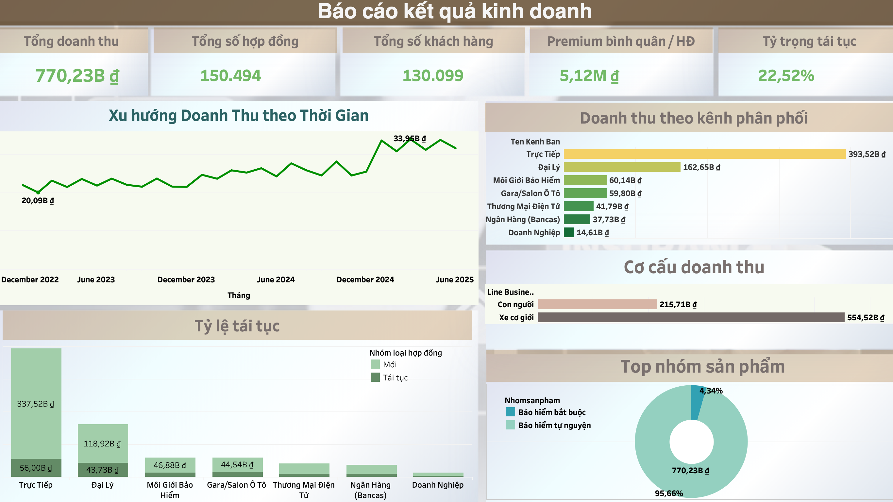
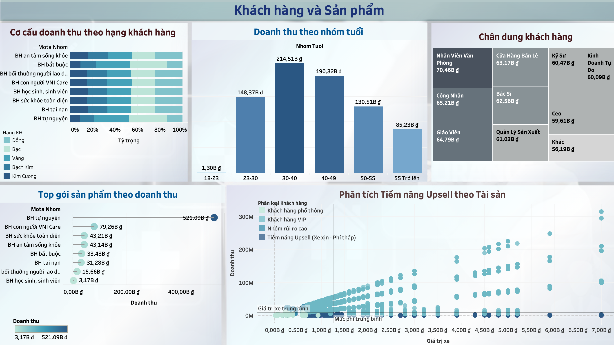
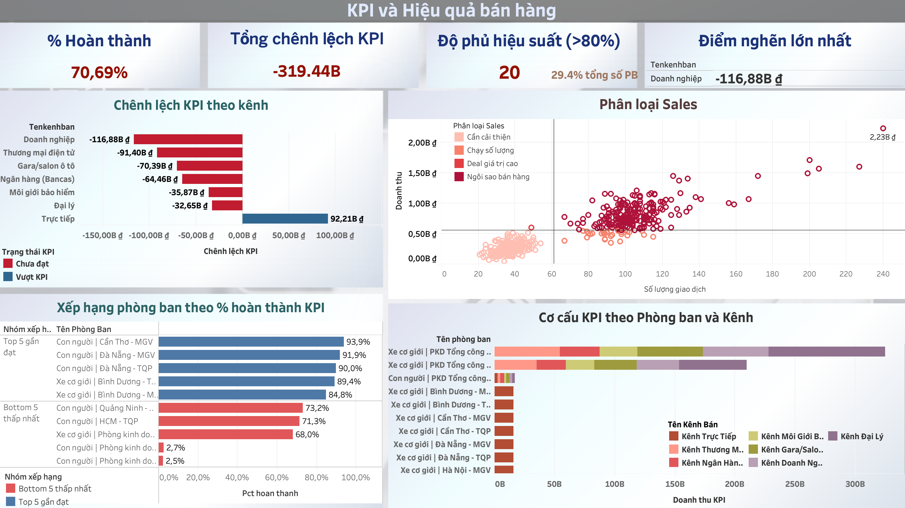

# Insurance Business Intelligence Dashboard — Data Explorers 2026

**Competition:** Data Explorers 2026 — Round 1: Data Storytelling  
**Track:** Insurance Business Intelligence / Management Dashboard  
**Tool:** Tableau  
**Result:** Top 15 Nationwide

## Overview

This project builds an interactive business intelligence dashboard for an insurance company with multiple subsidiaries, product lines, branches, departments, sales channels, and employees. The goal is to help management monitor business performance, understand customer and product patterns, evaluate KPI achievement, and identify practical opportunities for revenue growth and cross-selling.

The dashboard was designed for decision-makers who need a clear view of:

- Overall revenue performance and business trends
- Customer and product portfolio analysis
- Sales channel and branch performance
- KPI monitoring by department and sales team
- Cross-selling and performance-improvement opportunities
- Potential AI applications in insurance analytics

## Business Context

The case describes an insurance company seeking to move from traditional sales reporting toward data-driven management. Key business challenges include unstable revenue, underutilized cross-selling opportunities, difficulty evaluating distribution-channel effectiveness, and lack of transparent KPI monitoring for departments and sales employees.

## Dashboard Scope

### 1. Business Performance Report

Focuses on high-level revenue, contract, product, branch, and channel performance to support executive monitoring.

### 2. Customer & Product Analysis

Explores customer distribution, product mix, insurance package performance, and potential cross-selling opportunities.

### 3. KPI & Sales Performance Report

Evaluates KPI achievement across departments, branches, sales channels, and employees to support performance tracking and management decisions.

## Dashboard Preview

### Business Performance

### Channel & Product Analysis

### KPI & Performance Monitoring

## Tools & Skills Demonstrated

- Tableau dashboard design
- Data cleaning and preparation
- KPI monitoring and metric design
- Business intelligence reporting
- Customer and product segmentation
- Sales channel performance analysis
- Insight-driven storytelling
- Management recommendation framing

## Key Learning Outcomes

- Translated a broad business case into structured BI reporting layers.
- Designed dashboards around management questions rather than only visual aesthetics.
- Connected revenue, product, customer, and channel views to support business decision-making.
- Framed insights into practical recommendations for cross-selling, KPI monitoring, and channel performance improvement.

## Repository Notes

The original dataset is not included due to competition data restrictions. This repository contains dashboard screenshots and the problem statement for portfolio demonstration only. The Tableau packaged workbook can be shared privately upon request when appropriate.
